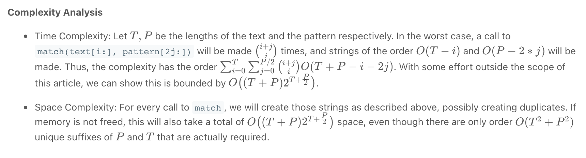

# Regular Expression Matching #hard

Given an input string `s` and a pattern `p`, implement regular expression matching with support for `'.'` and `'*'` where:

-   `'.'` Matches any single character.​​​​
-   `'*'` Matches zero or more of the preceding element.

The matching should cover the **entire** input string (not partial).

**Example 1:**

**Input:** s = "aa", p = "a"
**Output:** false
**Explanation:** "a" does not match the entire string "aa".

**Example 2:**

**Input:** s = "aa", p = "a*"
**Output:** true
**Explanation:** '*' means zero or more of the preceding element, 'a'. Therefore, by repeating 'a' once, it becomes "aa".

**Example 3:**

**Input:** s = "ab", p = ".*"
**Output:** true
**Explanation:** ".*" means "zero or more (*) of any character (.)".

**Example 4:**

**Input:** s = "aab", p = "c*a*b"
**Output:** true
**Explanation:** c can be repeated 0 times, a can be repeated 1 time. Therefore, it matches "aab".

**Example 5:**

**Input:** s = "mississippi", p = "mis*is*p*."
**Output:** false

**Constraints:**

-   `1 <= s.length <= 20`
-   `1 <= p.length <= 30`
-   `s` contains only lowercase English letters.
-   `p` contains only lowercase English letters, `'.'`, and `'*'`.
-   It is guaranteed for each appearance of the character `'*'`, there will be a previous valid character to match.

# Solution:

### recursion 来做 infinite state machine 来检查有没有 match 的可能:



这里介绍 recursion 的简便写法：

`pattern[i:]` 和 `string[i:]` 能不能 match, 取决于：

1. `pattern[i]` 和 `string[i]` 能不能match (相同或者```pattern[i]```是 ```. ```)
2. 如果 ```pattern[i+1]``` 是```*```，则考虑：
	1. 跳过 pattern 的 ```*``` 和 剩下的 string 对比
	2. 保留 pattern ```i 到 *``` 和剩下的string 对比
3. 如果不是，接着各自往下对比即可

```python

class Solution(object):
	def isMatch(self, text, pattern):
		if not pattern:
			return not text

		first_match = bool(text) and pattern[0] in {text[0], '.'}

		if len(pattern) >= 2 and pattern[1] == '*':
			return (self.isMatch(text, pattern[2:]) or
					first_match and self.isMatch(text[1:], pattern))
		else:
			return first_match and self.isMatch(text[1:], pattern[1:])

```


### DP

==**O(TP)/O(TP)**== 

T: len of string, P: len of patterns

1. **top down approach**：
```python
class Solution(object):
 def isMatch(self, text, pattern):
     memo = {}
     def dp(i, j):
         if (i, j) not in memo:
             if j == len(pattern):
                 ans = i == len(text)
             else:
                 first_match = i < len(text) and pattern[j] in {text[i], '.'}
                 if j+1 < len(pattern) and pattern[j+1] == '*':
                     ans = dp(i, j+2) or first_match and dp(i+1, j)
                 else:
                     ans = first_match and dp(i+1, j+1)

             memo[i, j] = ans
         return memo[i, j]

     return dp(0, 0)
```

> idea 就是用 (i,j) idx 来表示有没有 match 到, 然后一直往下找，直到 **i=T and j=P**


2. **==bottom up approach (better without recursion)==**

```python
class Solution(object):
 def isMatch(self, text, pattern):
     dp = [[False] * (len(pattern) + 1) for _ in range(len(text) + 1)]

     dp[-1][-1] = True
     for i in range(len(text), -1, -1):
         for j in range(len(pattern) - 1, -1, -1):
          	 # pattern[j] match pattern[i]
             first_match = i < len(text) and pattern[j] in {text[i], '.'}
             if j+1 < len(pattern) and pattern[j+1] == '*':
              	 # 1. * can be zero length, text[i] match pattern[j+2]
                 # 2. first match
                 dp[i][j] = dp[i][j+2] or first_match and dp[i+1][j]
             else:
                 dp[i][j] = first_match and dp[i+1][j+1]

     return dp[0][0]

```

