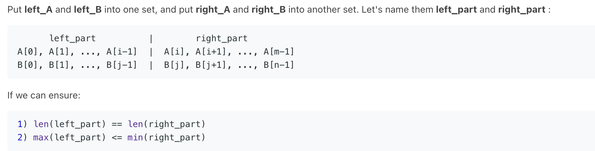

# Median of two sorted arrays #hard

Given two sorted arrays `nums1` and `nums2` of size `m` and `n` respectively, return **the median** of the two sorted arrays.

The overall run time complexity should be `O(log (m+n))`.

**Example 1:**

```
Input: nums1 = [1,3], nums2 = [2]
Output: 2.00000
Explanation: merged array = [1,2,3] and median is 2.
```

**Example 2:**

```
Input: nums1 = [1,2], nums2 = [3,4]
Output: 2.50000
Explanation: merged array = [1,2,3,4] and median is (2 + 3) / 2 = 2.5.
```

**Example 3:**

```
Input: nums1 = [0,0], nums2 = [0,0]
Output: 0.00000
```

**Example 4:**

```
Input: nums1 = [], nums2 = [1]
Output: 1.00000
```

**Example 5:**

```
Input: nums1 = [2], nums2 = []
Output: 2.00000
```

 

**Constraints:**

- `nums1.length == m`
- `nums2.length == n`
- `0 <= m <= 1000`
- `0 <= n <= 1000`
- `1 <= m + n <= 2000`
- `-106 <= nums1[i], nums2[i] <= 106`


# Solution:

1. 如果brute force 我们直接 merge，得到median就 O(m+n). 看到题目要求 O(log(m+n)), 知道应该使用 binary search. 
2. ==**考虑，如果我们在 array A 中找到一个index i，在 array B 中对应的 index j（median或median旁边），必须满足 i + j = (m + n + 1)/2. 而且，必须满足 A[i-1] < B[j] 且 B[j-1] < A[i]。**==
3. 如果 A[i-1] > B[j], 证明说 A[i] 会比真正 median 大，所以 i 减小；反之亦然。

总结起来就是这个图片：



结合以上的点，我们选择在 array A 里面搜索，然后找到 对应的 array B 中的 index j, 之后接着判断。 

==这里我们因为 j = (m+n+1)/2 - i 得到，**保证 j >= 0, 所以需要 m <= n。**而且也加快搜索速度！！！== 

```python
def findMedianSortedArrays(self, A, B):
        m, n = len(A), len(B)
        if m > n:
            A, B, m, n = B, A, n, m
        # if n == 0:
        #     raise ValueError

        imin, imax, half_len = 0, m, (m + n + 1) / 2
        while imin <= imax:
            i = (imin + imax) / 2
            j = half_len - i
            if i < m and B[j-1] > A[i]:
                # i is too small, must increase it
                imin = i + 1
            elif i > 0 and A[i-1] > B[j]:
                # i is too big, must decrease it
                imax = i - 1
            else:
                # i is perfect

                if i == 0: max_of_left = B[j-1]
                elif j == 0: max_of_left = A[i-1]
                else: max_of_left = max(A[i-1], B[j-1])
                    
                if (m + n) % 2 == 1:
                    return max_of_left

                if i == m: min_of_right = B[j]
                elif j == n: min_of_right = A[i]
                else: min_of_right = min(A[i], B[j])

                return (max_of_left + min_of_right) / 2.0
```

==**注意这里 i 的搜索范围是 [0,m] (0,m 都包括), 因为 i 类似于 cut，i=0 代表 A[0] 也在 right_part, i=m 代表 A[m-1] 在 left_part**==

因为 (m+n+1)/2 保证了左边比右边长，所以如果奇数的话，max_of_left 就是 median